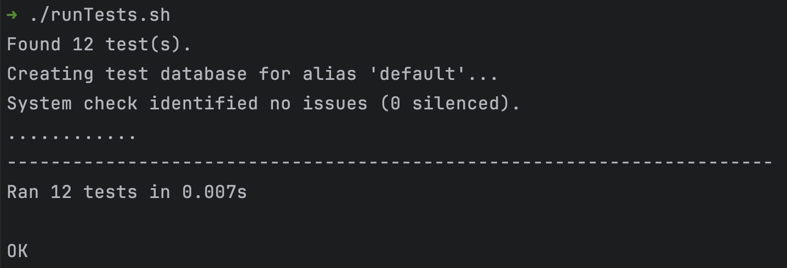

### TEAM NAME: 
**Team Fun**

### MEMBERS / ROLES:
- Andrew Doyle - Scrum Master / Developer
- Mark Aylward - Product Owner / Developer
- Daniel Bodner - Developer
- Karun Subramanian - Developer
- Veronika Post - Developer

### PRODUCT VISION:
**Project Name:** Grandma's Recipe Box (GRB)

**Project Description:** Grandma’s Recipe Box is a comprehensive meal planning tool that allows users to create recipes,
plan their weekly meals and seamlessly generate an organized shopping list with all necessary ingredients.

**Far Vision:** Organize the world's recipes - and your kitchen.

**Near Vision:** A place to digitally store all of your family's "secret" recipes alongside a set of popular dishes.

**Stakeholder Types:**
- Busy professionals looking to eat healthier
- Grocery delivery services
- People trying to preserve family recipes
- Gym-goers planning on meal-prepping
- People with food allergies
- People with dietary restrictions
- Working parents

### STAKEHOLDER ANALYSIS:
**User Persona:**
- Name: Vani
- Role: Working professional
- Age: 35
- Gender: Female
- Skill level 1: Knowledgeable about nutrition and diet
- Skill level 2: Avid home cook
- Skill level 3: Frugal shopper
- Motivation: Make meal planning and grocery shopping fun and efficient.
- Desires/ wants/ needs: Wants to be able to meal plan using the recipes in a calendar based format. Also wants
to create a shopping list quickly and accurately. Potentially outsource shopping to someone else during busy
weeks. Wants herself and her family to be healthy by avoiding processed foods and take out. Wants to save money
by eating at home and shopping for groceries on sale.

### BACKLOG:

**Backlog Link**
[Jira Backlog](https://doylead.atlassian.net/jira/software/projects/E71/boards/2/backlog?atlOrigin=eyJpIjoiZjliZTg5YmI3ZGY2NDljOWJjMmM3OTM2ZjNhNzVlNGMiLCJwIjoiaiJ9&cloudId=56827f1d-9c14-485c-8ee9-3e41b8b2df97&selectedIssue=E71-16)

**Order Rationale:** We picked these backlog items for the first sprint so that we would have a solid foundation for 
implementation of future features that the stakeholders required.

1. **Create user account:** This is essential for users to register their account and begin storing their 
recipes securely. This also facilitates future feature development by establishing account and recipe databases.
2. **Delete user account:** The user would like to be able to delete their account in an easily accessible way. This
promotes positive business practices and user autonomy.
3. **Add recipes:** After the user creates an account, the user needs to be able to add recipes to their recipe box.
This is a necessary function of the app.
4. **Secure recipes:** Ensures that users' recipes protected and accessible to their account. This maintains privacy
and security.
5. **Save recipes between sessions:** The user needs to be able to save their recipes and reliably access them every 
time they use the app.
6. **View recipe:** The user needs to be able to view their recipe in a format that is legible and accessible. This
allows the user to have a better cooking experience.
7. **Browse recipes:** The user also needs to be able to browse all of their stored recipes to improve usability.
8. **Delete a recipe:** The user may encounter a recipe that they did not like so the user needs to be able to delete
this recipe. The user should have control over their content.
9. **Edit a recipe:** The user needs to be able to modify the recipe in case of mistakes or updates. The helps with
flexibility and recipe accuracy.
10. **Tag recipe:** The user needs to be able to add tags to a recipe. This will make a future filter implementation
possible.
11. **Filter by recipe tags:** The user would like to filter their recipes by specific tags. This will make recipe 
organization and visibility a lot better.
12. **Filter by cook time:** The user wants to filter the recipe by cook time so that they do not pick complicated 
recipes to make on a busy week night.
13. **Annotate recipes:** The user wants to take notes on their recipe in order to accommodate preferences of people
that they may be cooking for.
14. **Share recipes:** The user next wants to share their recipes with their loved ones either by printing or email. 
    

### SPRINT PLANNING:
**Definition of Ready:**
- PBI has an estimated size (and it should be small)
- PBI is clearly articulated and not ambiguous
- PBI is expressed as a user story (“As a ______, I want ______ so that I can ______”)
- PBI has acceptance criteria
- All dependencies for PBI are known
- Developers have had the opportunity to ask questions

# SPRINT 1

### FORECAST

**Forecasted Number of Story Points:** 25

**Forecast Rationale:** We chose this number of story points based on skill levels, number of team members, and
scheduling impediments. Our stories are all very small so, as a team, we decided to try and tackle 25.5 points for our
first sprint. The primary impediment for our team is scheduling for mod programming sessions. We have 5 team members in
three separate time zones. We have currently committed meeting twice weekly for two hours with the caveat of augmenting 
as necessary to ensure minimum viable product by the end of the sprint.

**[Backlog Planning Evidence:](https://agilesoftwarecourse.slack.com/archives/C07TUEH8HFD/p1730938293987819?thread_ts=1730938222.647509&cid=C07TUEH8HFD)**
This is evidence that only developers participated in the sprint planning and move of PBIs into sprint.

### KANBAN AND BURNDOWN
**[Kanban Board:](https://doylead.atlassian.net/jira/software/projects/E71/boards/2?atlOrigin=eyJpIjoiMzNiODIxZTdmNDEyNDUwMjhkMzVkY2Q3OTFlM2VhNzMiLCJwIjoiaiJ9)**
Kanban board for Sprint 1.

**[Burndown Chart:](https://doylead.atlassian.net/jira/software/projects/E71/boards/2/reports/burndown?source=sidebar&atlOrigin=eyJpIjoiMGZhNTc1MDY4NzI4NGM1NmI2NGU2YjUyN2ZiNDMzNGYiLCJwIjoiaiJ9)**
Burndown chart for sprint 1

### SCRUM AND MOB PROGRAMMING EVIDENCE
**[Daily Scrum/Mob Programming 1:](https://agilesoftwarecourse.slack.com/archives/C07TUEH8HFD/p1730944745702459?thread_ts=1730938222.647509&cid=C07TUEH8HFD)**
First daily scrum and first mob programming session.

**[Daily Scrum/ Mob Programming 2:](https://agilesoftwarecourse.slack.com/archives/C07TUEH8HFD/p1731269669117479?thread_ts=1730938222.647509&cid=C07TUEH8HFD)**
Second daily scrum and mob programming session.

**[Daily Scrum/ Mob Programming 3:](https://agilesoftwarecourse.slack.com/archives/C07TUEH8HFD/p1731545160518449?thread_ts=1730938222.647509&cid=C07TUEH8HFD)**
Third daily scrum and mob programming session.

### SPRINT GOAL QUESTIONS, SPRINT TASK BOARD, AND BURNDOWN UPDATES

**What did we do to help meet sprint goal?**
**What do we plan to do to meet the sprint goal?**
**Do we have any impediments?** 
**What are our impediments?** 
**What do we plan to do to remove them?**

Answers to all of these questions along with task board/ burndown updates can be found in the following links:

**[Daily Scrum Notes Nov 6 2024](agile_artifacts/DailyScrum_Nov06.md)**

**[Daily Scrum Notes Nov 10 2024](agile_artifacts/DailyScrum_Nov10.md)**

**[Daily Scrum Notes Nov 13 2024](agile_artifacts/DailyScrum_Nov13.md)**

### UNIT TEST EVIDENCE

**[Unit Test File](grb/project/test.py)**

**Passing Unit Tests Screen Cap**
****

### WORKING SOFTWARE 
**[GRB:]()**
Link to functional Grandma's Recipe Box.

### STAKEHOLDER
**[Stakeholder Evidence:]()**
Screen capture of stakeholder in sprint review.

