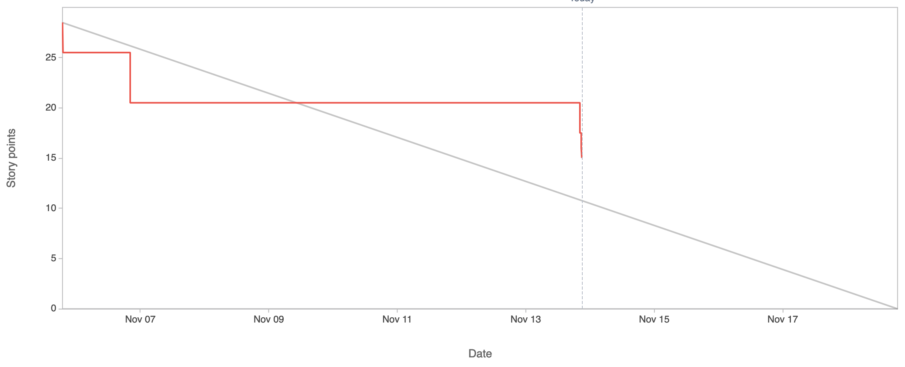

Attendees: Danny, Mark, Andrew, Veronika, Karun

Recapped work from last working session.

Sprint burndown chart so far:

Impediments:
* Do we want to add 
* Reminder: Next sprint starts 11/18.  Stakeholder meeting scheduled for 11/17
* Reminder: Forecast may be incorrect (we had limited data to predict velocity)
* Review of rubric

Done:
* Added unit tests for several methods
* Added recipe instruction formatting as an ordered list
* Added formatting for ingredients (removing commas)
* Added browse recipe page
* Added recipe delete functionality

TODO:
* Prepare for stakeholder meeting
* Use POST request to delete objects